# Mohammed Sadique

  

  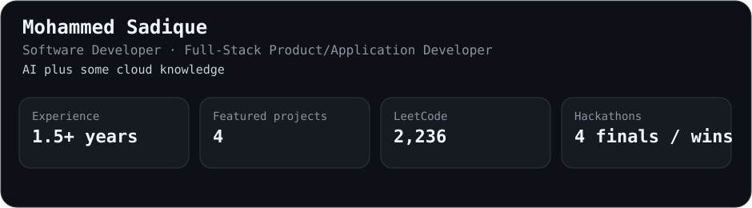

## About

I build full-stack product applications, AI-assisted developer tools, and backend systems with a focus on shipping useful software.

I prefer building:
- full-stack product and application software
- AI-assisted tools and workflows
- backend systems with clean interfaces
- small cloud-aware deployments over unnecessary infrastructure

## Experience

  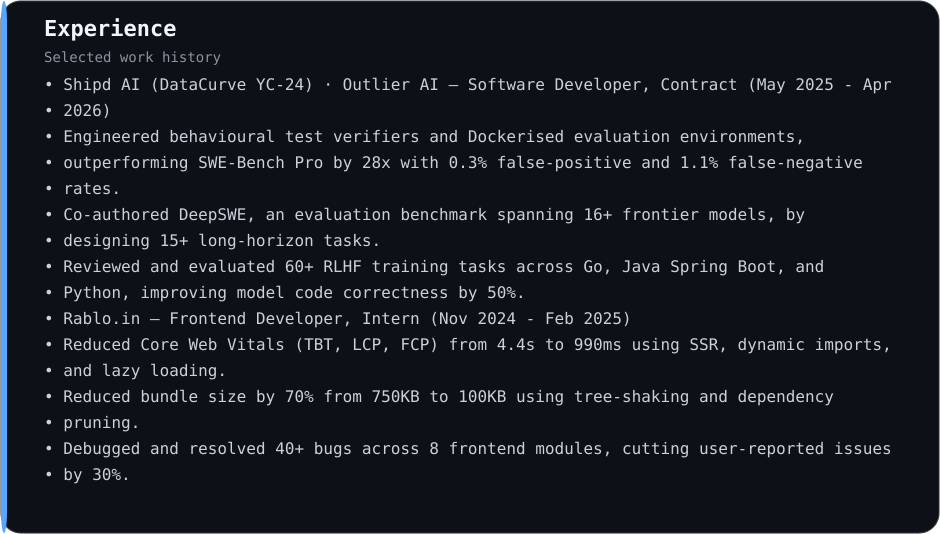

## Featured Projects

### Tier 1

  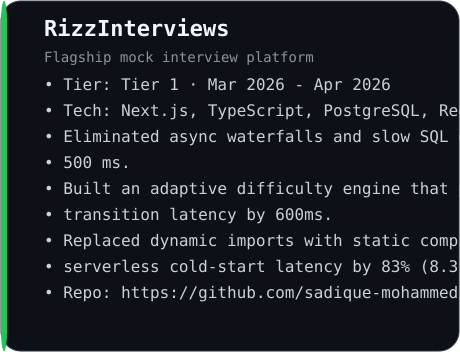
  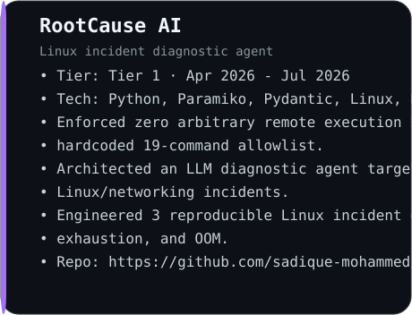

  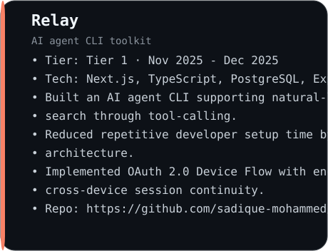
  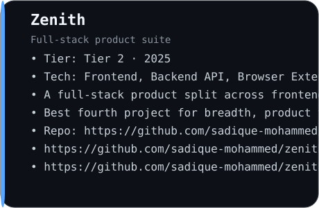

### Links

- **RizzInterviews**: https://github.com/sadique-mohammed/rizz-interviews
- **RootCause AI**: https://github.com/sadique-mohammed/rootcause-ai
- **Relay**: https://github.com/sadique-mohammed/relay-cli
- **Zenith**: https://github.com/sadique-mohammed/zenith-frontend · https://github.com/sadique-mohammed/zenith-backend · https://github.com/sadique-mohammed/zenith-extension

## Skills

  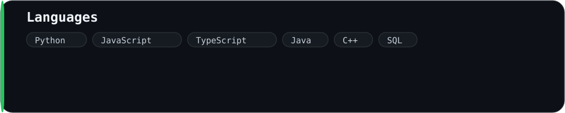

  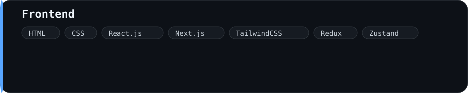

  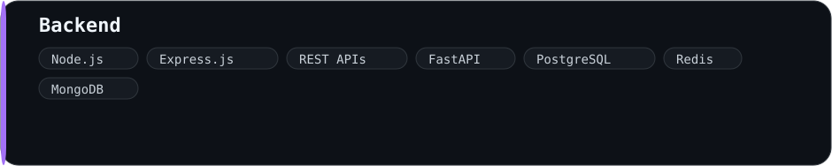

  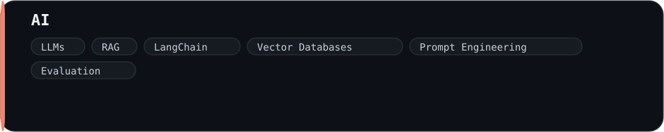

  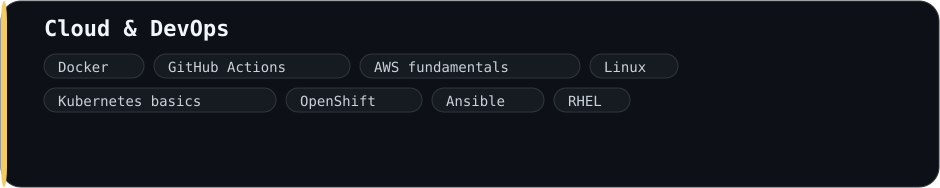

  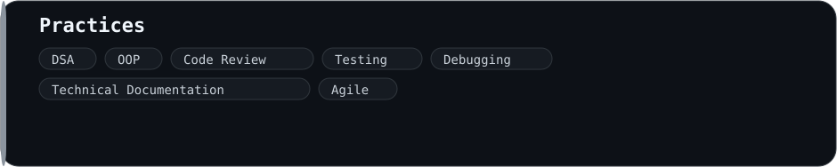

## Achievements

  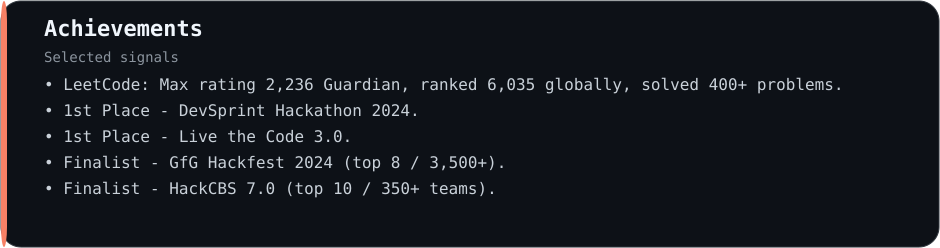

## Currently Focused On

- SWE / Full-stack product and application development
- AI-powered developer tools and backend systems
- Cloud fundamentals: Docker, Linux, GitHub Actions, AWS basics, Kubernetes basics

## Contact

  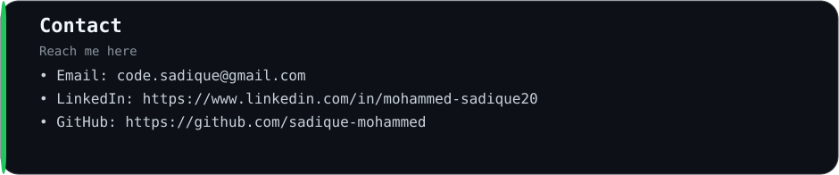

- Email: code.sadique@gmail.com
- LinkedIn: https://www.linkedin.com/in/mohammed-sadique20
- GitHub: https://github.com/sadique-mohammed

---

Repository generated from a config-driven profile engine so the README, assets, and workflow stay in sync.
